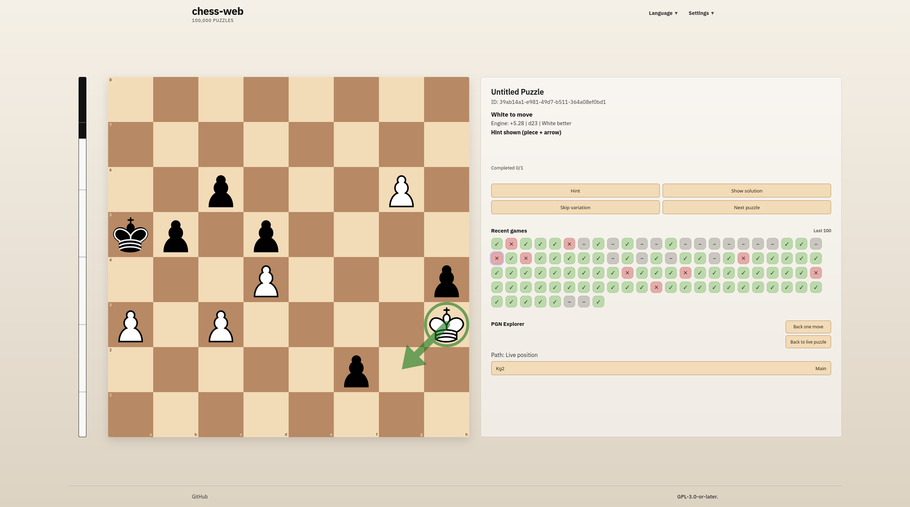
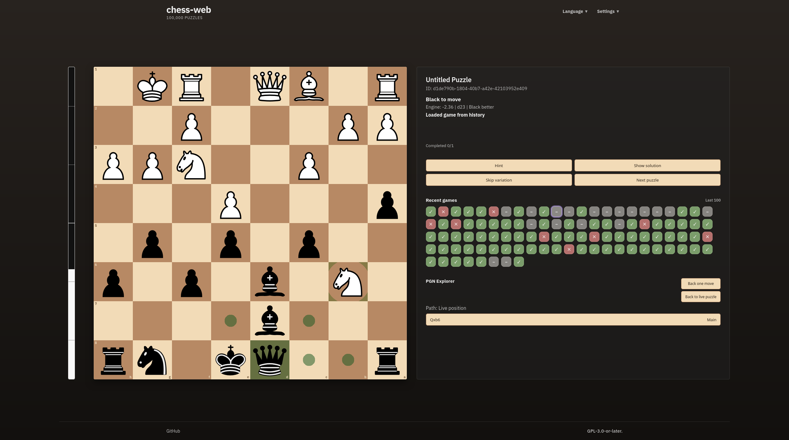
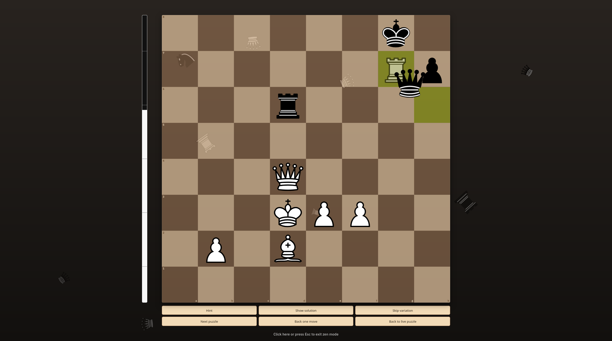

# chess-web

<p align="center">
  
</p>

No-account chess puzzle trainer with PGN variation support, server-side move validation, browser Stockfish eval, recent-game history, and a fast split-layout UI built for repeated puzzle solving.

## Screenshots

### Light Mode



### Dark Mode



### Settings

- Languages: English, Deutsch, 中文, Español, Français, Русский
- Gameplay: explore variations, skip similar variations, auto-next, hints, one-try mode, auto-queen
- Display and feedback: dark mode, zen mode, board glass, engine eval, animations, sound, capture rain
- Automation and tools: autoplay plus direct puzzle loading by ID

### Zen Mode



## What It Does

- Serves PGN-based tactical puzzles with variation trees
- Validates moves on the server instead of trusting the browser
- Supports explore/mainline solving flows
- Tracks recent games with replayable history
- Includes hints, reveal, skip variation, restart, and next puzzle flows
- Supports autoplay, auto-next, one-try mode, auto-queen, sounds, and animations
- Shows optional in-browser Stockfish eval with an eval bar
- Works with local Postgres or in-memory `pg-mem` during development

## Stack

- Frontend: React, Vite, TypeScript, Chessground
- Backend: Fastify, TypeScript, Postgres
- Shared chess logic: `packages/chess-core`
- DB layer: `packages/db`
- Workspace: `pnpm`

## Repo Layout

- `apps/web`: React client
- `apps/api`: Fastify API
- `packages/chess-core`: PGN parsing and puzzle domain logic
- `packages/db`: migrations, repositories, DB client
- `docs`: architecture and flow documentation
- `assets`: documentation screenshots and app icon

## Quick Start

1. Copy the env file:

```bash
cp .env.example .env
```

2. Install dependencies:

```bash
npx pnpm@10.5.2 install
```

3. Start the full app:

```bash
./start.sh
```

Default local URLs:

- Web: `http://localhost:5173`
- API: `http://localhost:3001`

## Database And Puzzle Import

The API supports both:

- local Postgres via `DATABASE_URL`
- in-memory `pgmem://local` for dev fallback

Run migrations manually:

```bash
npx pnpm@10.5.2 --filter @chess-web/api migrate
```

Import a PGN puzzle file:

```bash
npx pnpm@10.5.2 --filter @chess-web/api import:pgn -- --file /path/to/puzzles.pgn --token "$IMPORT_TOKEN"
```

If `SEED_PGN_FILE` is set and the puzzle table is empty, the API can also seed puzzles automatically on startup.

## Useful Commands

From the repo root:

```bash
npx pnpm@10.5.2 -r typecheck
npx pnpm@10.5.2 -r lint
npx pnpm@10.5.2 -r test
npx pnpm@10.5.2 -r build
```

Run apps separately:

```bash
npx pnpm@10.5.2 --filter @chess-web/api dev
npx pnpm@10.5.2 --filter @chess-web/web dev
```

## API Surface

- `POST /api/v1/session/start`
- `POST /api/v1/session/load`
- `POST /api/v1/session/move`
- `POST /api/v1/session/hint`
- `POST /api/v1/session/reveal`
- `POST /api/v1/session/skip-variation`
- `POST /api/v1/session/next`
- `POST /api/v1/session/history`
- `POST /api/v1/session/history/clear`
- `POST /api/v1/session/tree`
- `GET /api/v1/puzzles/:publicId/tree` in non-production debug mode
- `GET /health`

## Documentation

- [docs/README.md](docs/README.md)
- [docs/architecture.md](docs/architecture.md)
- [docs/api-and-session-flow.md](docs/api-and-session-flow.md)
- [docs/frontend-flow.md](docs/frontend-flow.md)
- [docs/database-model.md](docs/database-model.md)

## Licensing

- Repository licenses: [LICENSE](LICENSE), [LICENSE.txt](LICENSE.txt)
- Piece asset notice: `apps/web/public/pieces/cburnett/NOTICE.txt`
- Sound pack notices:
  - `apps/web/public/sounds/lichess-standard/LICENSE.txt`
  - `apps/web/public/sounds/lichess-sfx/LICENSE.txt`
- Curated runtime dependency notices: [THIRD_PARTY_LICENSES.json](THIRD_PARTY_LICENSES.json)

Regenerate the curated runtime notice file with:

```bash
node scripts/generateThirdPartyLicenses.mjs
```

## Notes

- Browser-side anti-download prevention is only best-effort.
- The app uses runtime rate limits and avoids bulk download-oriented endpoints.
- The default runtime audio pack is `lichess-standard`.
- Deployment notes live in [ops/oracle-cloudflare.md](ops/oracle-cloudflare.md).
