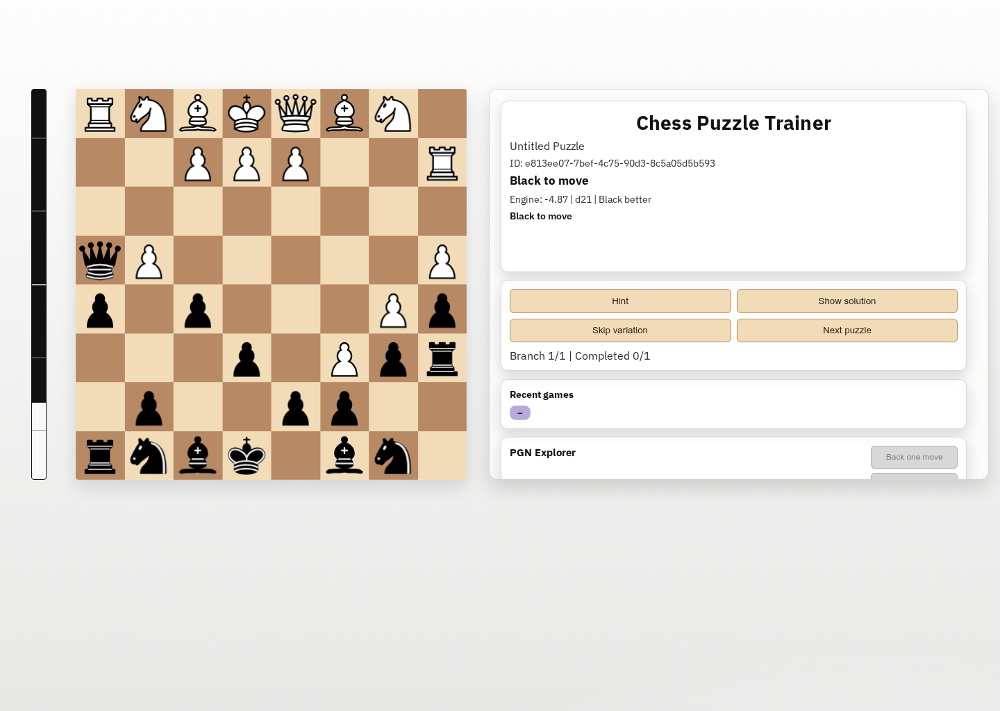

# Chess Puzzle Web

No-account chess puzzle trainer with PGN variation support, server-side move validation, browser Stockfish evaluation, and random puzzle delivery.

## Screenshot



## Stack

- Monorepo: `pnpm` workspaces
- Frontend: React + Vite + TypeScript (`apps/web`)
- Backend: Fastify + TypeScript + Postgres (`apps/api`)
- Shared domain logic: `packages/chess-core`
- DB schema/repositories: `packages/db`

## Core Features

- PGN-driven tactical puzzle sessions with variation exploration
- Recent puzzle history with status chips and direct replay/loading
- Hint system + reveal solution + skip variation + restart puzzle
- Optional autoplay, auto-next, sound, animation, and auto-queen
- PGN explorer panel for reviewing continuation nodes
- Browser Stockfish analysis and eval bar (toggleable in Settings)

## Quick Start

1. Copy env:

```bash
cp .env.example .env
```

2. Install dependencies:

```bash
npx pnpm@10.5.2 install
```

3. Run migrations:

```bash
npx pnpm@10.5.2 --filter @chess-web/api migrate
```

4. Import PGN puzzles:

```bash
npx pnpm@10.5.2 --filter @chess-web/api import:pgn -- --file /path/to/puzzles.pgn --token "$IMPORT_TOKEN"
```

5. Run both apps in one terminal:

```bash
./start.sh
```

Optional manual mode:

```bash
npx pnpm@10.5.2 --filter @chess-web/api dev
npx pnpm@10.5.2 --filter @chess-web/web dev
```

- API: `http://localhost:3001`
- Web: `http://localhost:5173`

## Scripts

From repo root:

```bash
npx pnpm@10.5.2 install
npx pnpm@10.5.2 -r typecheck
npx pnpm@10.5.2 -r lint
npx pnpm@10.5.2 -r test
npx pnpm@10.5.2 -r build
```

One-shot build script:

```bash
./build.sh
```

## API (MVP)

- `POST /api/v1/session/start`
- `POST /api/v1/session/move`
- `POST /api/v1/session/hint`
- `POST /api/v1/session/reveal`
- `POST /api/v1/session/skip-variation`
- `POST /api/v1/session/next`
- `POST /api/v1/session/history`
- `GET /api/v1/session/tree`
- `POST /api/v1/session/load`
- `GET /health`

## Licensing and Third-Party Notices

- See [LICENSE](LICENSE) and [LICENSE.txt](LICENSE.txt) for repository licensing terms and third-party requirements.
- Bundled asset notices:
  - `apps/web/public/pieces/cburnett/NOTICE.txt`
  - `apps/web/public/sounds/lichess-sfx/LICENSE.txt`
- Machine-readable dependency license inventory:
  - `THIRD_PARTY_LICENSES.json`
  - Regenerate with: `node scripts/generateThirdPartyLicenses.mjs`
- The app intentionally uses the free `lichess-sfx` sound pack for runtime audio.

## Notes

- Full anti-download prevention is impossible in browsers; this app uses best-effort hardening (rate limits, per-session fetch, no bulk endpoints).
- File-size limit is enforced in ESLint (`max-lines <= 2000`).
- Launch deployment target docs: [ops/oracle-cloudflare.md](ops/oracle-cloudflare.md)
